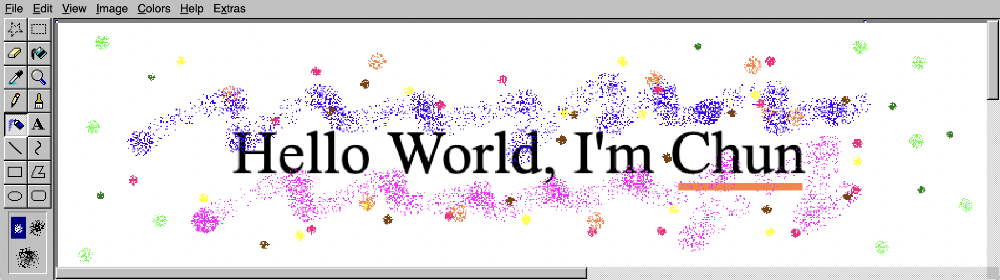
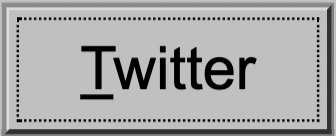
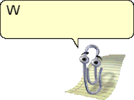
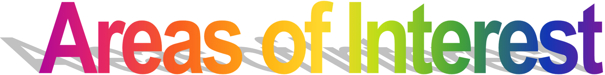
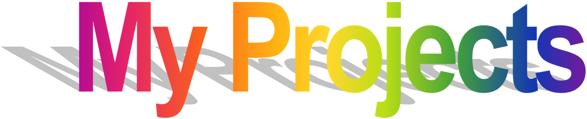

 
 

Hello! I'm Chun, 22 y/o hacker and entrepreneur who enjoys building fun stuff on the internet.
- I quit my Web2 job to become full-time Web3 contributor (and build stuff I enjoy with).
- I previously worked at [ThoughtWorks](https://www.thoughtworks.com/) and [Cleverse](https://cleverse.com/) as a software engineer.
- I currently learning Rust, Three.js, and other cool stuff!
- I'm mastering Web3 by building little projects e.g. [Uniswap Calculator](https://uniswapv3.thechun.dev/), [ETHTalk](https://ethtalk.app/)
- I actively tweet about what I've learned and what I've built. Follow me on [Twitter](https://twitter.com/chunza2542)
- Current hobbies: reading a book ([visit my bookshelf](https://www.goodreads.com/review/list/148571752-chun?utf8=%E2%9C%93&shelf=read&title=chun&sort=avg_rating&order=d)), jogging, meditation, [bloging](https://medium.com/chunza2542), and playing guitar (meet my idols: [Tommy Emmanuel](https://www.youtube.com/watch?v=1Khi2xaBTI4), [Joe Robinson](https://www.youtube.com/watch?v=zszIWqY3F2Q), [Sungha Jung](https://www.youtube.com/watch?v=mkRsz7didXI))
- Pronouns: he/him
- Fun Fact: I first got interested in computers because I want to customize my Window 2000 to look cool.

 

- **Software engineering.** 
- **Product development.** 
- **Entrepreneurship.**
- **Education.** 
- **Web3.**

 

- Coming soon. Now, you can check my pinned repositories below. 

 

